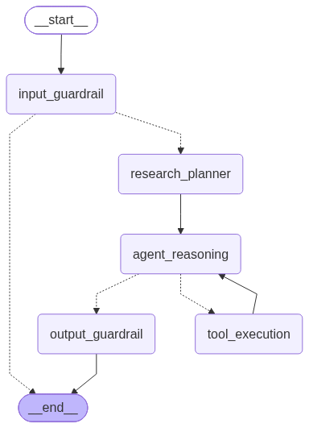

# Competitive Intelligence LangGraph Multi-Agent System

An end-to-end autonomous competitive intelligence system built with LangGraph, Flask, Streamlit, and Qdrant Cloud. The agent ingests, filters, retrieves, and synthesizes unstructured market data to produce executive intelligence dossiers.

---

## Architecture Overview

The system follows a multi-node cyclical state graph architecture with explicit safety guardrails, dynamic vector retrieval, and synthesis capabilities.



### Graph Nodes
1. **input_guardrail**: Enforces strict policy validation against prompt injection, malicious instructions, and out-of-scope directives.
2. **agent_reasoning**: Formulates strategic queries, decides which tools to invoke, and processes retrieved facts.
3. **execute_tools**: Executes deterministic tool calls against the vector database or external feeds.
4. **synthesizer**: Aggregates intermediate observations into a structured executive dossier.
5. **output_guardrail**: Verifies content hygiene, ensuring no prompt leaks, toxicity, or safety policy violations exist in the final dossier.

---

## Tech Stack

- **Agent Framework**: LangChain & LangGraph
- **Vector Database**: Qdrant Cloud (Cosine Similarity, `text-embedding-3-small`)
- **Backend API**: Flask REST API (Port 5000)
- **Frontend UI**: Streamlit (Port 8501)
- **Containerization**: Docker & Docker Compose

---

## Directory Structure

```text
Final Project Ido Cohen/
├── data/
│   └── competitor_profiles.json
├── docs/
│   └── langgraph_visualization.png
├── src/
│   ├── app.py
│   ├── graph.py
│   ├── rag_ingestion.py
│   └── tools.py
├── .env.example
├── .gitignore
├── docker-compose.yml
├── Dockerfile
├── README.md
├── requirements.txt
└── streamlit_app.py